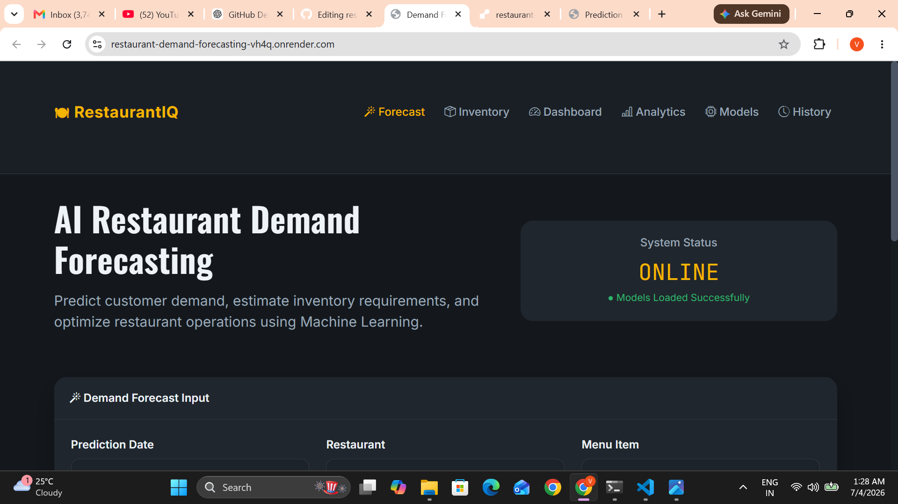
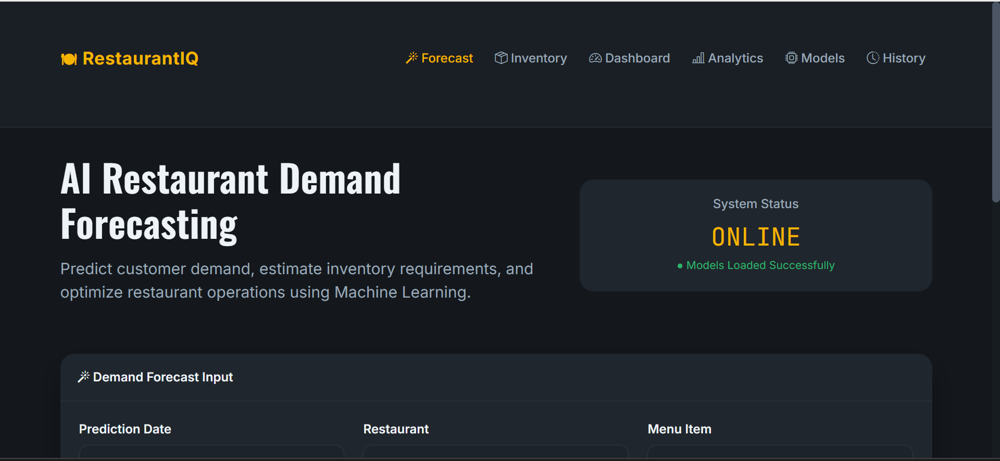
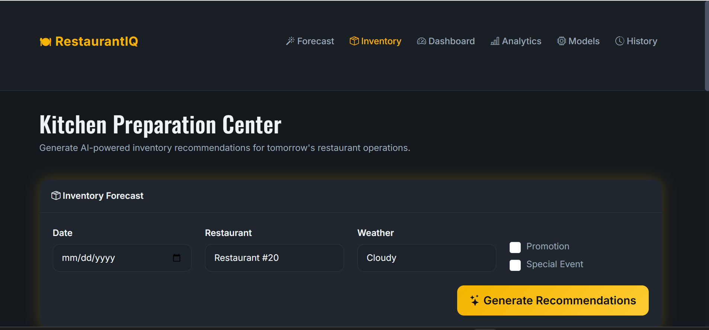
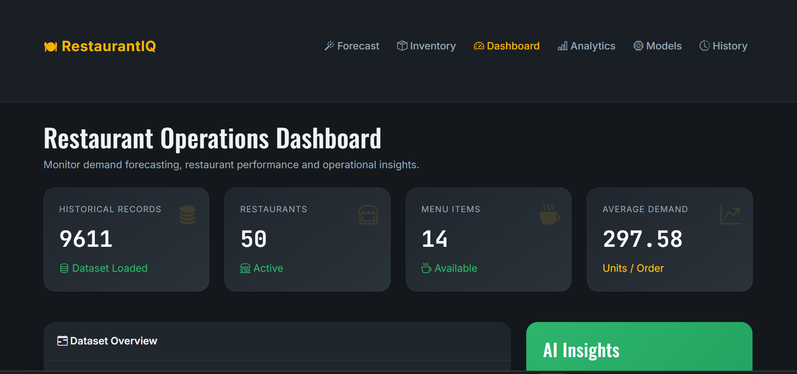
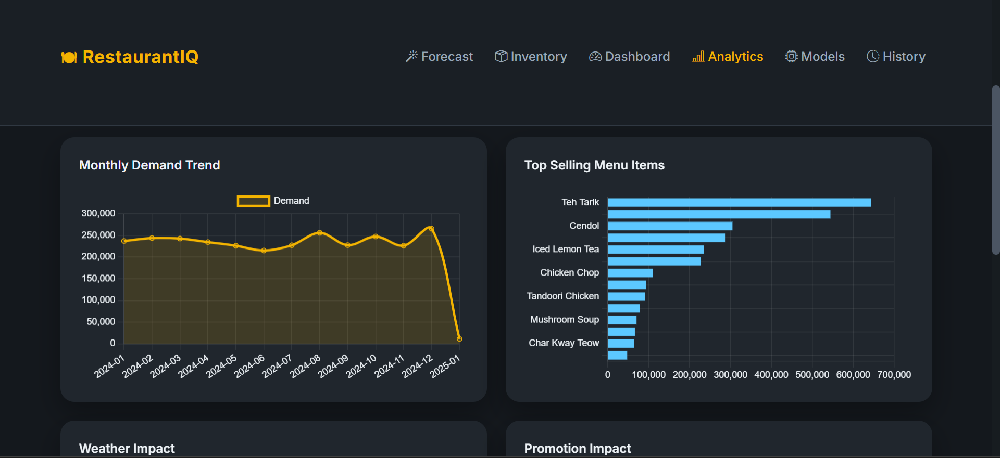
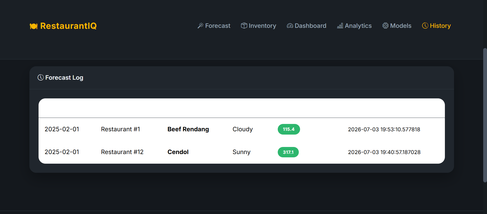

# 🍽️ RestaurantIQ

<div align="center">

### AI-Powered Restaurant Demand Forecasting & Inventory Recommendation System

Predict restaurant demand using Machine Learning and optimize inventory planning with intelligent recommendations.

[](https://restaurant-demand-forecasting-vh4q.onrender.com/)


</div>

---

# 🌐 Live Demo

🚀 **Try the application here**

### https://restaurant-demand-forecasting-vh4q.onrender.com/

> **Note:** The application is hosted on Render's free plan. If inactive, it may take **30–60 seconds** to wake up.

---

# 📖 Project Overview

RestaurantIQ is a Machine Learning-based web application that predicts restaurant demand and provides inventory recommendations to help restaurant owners optimize stock planning, reduce food wastage, and improve operational efficiency.

The application compares multiple Machine Learning algorithms and presents the best-performing model through an interactive dashboard.

---

# ✨ Features

- 📈 Restaurant Demand Forecasting
- 🍽 Smart Inventory Recommendation
- 🤖 Multiple Machine Learning Models
- 📊 Interactive Dashboard
- 📉 Sales Analytics
- 📚 Prediction History
- 💾 SQLite Database Integration
- 🌐 Live Web Application
- 📱 Responsive Bootstrap UI

---

# 🧠 Machine Learning Models

The project compares multiple regression algorithms:

- Linear Regression
- Random Forest Regression
- XGBoost Regressor
- LightGBM Regressor

The system evaluates these models and uses the best-performing model for prediction.

---

# 🛠️ Technology Stack

## Backend

- Python
- Flask
- SQLAlchemy

## Machine Learning

- Scikit-Learn
- XGBoost
- LightGBM
- Pandas
- NumPy
- Joblib

## Frontend

- HTML5
- CSS3
- Bootstrap 5
- JavaScript

## Database

- SQLite

## Deployment

- Render

---

# 📷 Application Screenshots

## 🏠 Home Page



---

## 📈 Prediction



---

## 🍽 Inventory Recommendation



---

## 📊 Dashboard



---

## 📉 Analytics



---

## 📚 Prediction History



---

# ⚙️ System Workflow

```text
                User
                  │
                  ▼
        Flask Web Application
                  │
                  ▼
         Feature Engineering
                  │
                  ▼
      Machine Learning Models
       ├── Linear Regression
       ├── Random Forest
       ├── XGBoost
       └── LightGBM
                  │
                  ▼
         Demand Prediction
                  │
                  ▼
    Inventory Recommendation
                  │
                  ▼
      Dashboard & Analytics
```

---

# 📂 Project Structure

```text
RestaurantIQ
│
├── dataset/
├── database/
├── saved_models/
├── screenshots/
├── static/
├── templates/
│
├── app.py
├── config.py
├── model.py
├── models.py
├── Procfile
├── requirements.txt
└── README.md
```

---

# 🚀 Installation

Clone the repository

```bash
git clone https://github.com/vrs2k5/restaurant-demand-forecasting.git
```

Move into the project

```bash
cd restaurant-demand-forecasting
```

Create a virtual environment

```bash
python -m venv venv
```

### Windows

```bash
venv\Scripts\activate
```

### Linux / macOS

```bash
source venv/bin/activate
```

Install dependencies

```bash
pip install -r requirements.txt
```

Run the application

```bash
python app.py
```

Open your browser and visit:

```text
http://127.0.0.1:5000
```

---

# 🚀 Future Enhancements

- PostgreSQL Integration
- User Authentication & Authorization
- Docker Support
- CI/CD with GitHub Actions
- Real-time Demand Forecasting
- Cloud Storage Integration
- REST API Documentation
- Mobile Application

---

# 👨‍💻 Developer

### **Venkata Ramana Sai Nimmakanti**

- **GitHub:** https://github.com/vrs2k5
- **LinkedIn:** *(https://www.linkedin.com/in/venkata-ramana-sai-nimmakanti-450718298/)*

---

# ⭐ Support

If you found this project useful, please consider giving it a ⭐ on GitHub.

Your support helps improve the project and motivates future development.

---

<div align="center">

### 🍽️ RestaurantIQ

**Built with ❤️ using Python, Flask & Machine Learning**

</div>